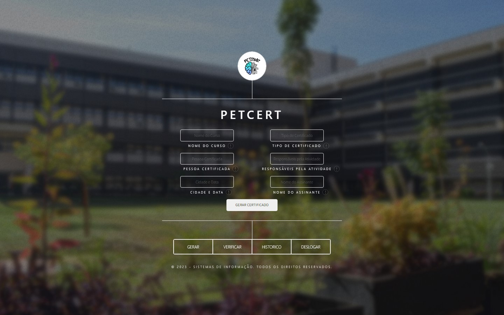
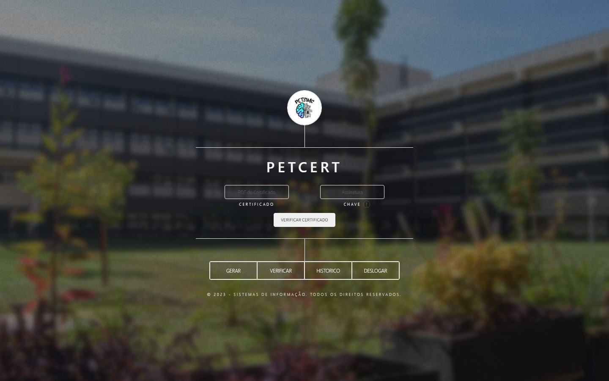
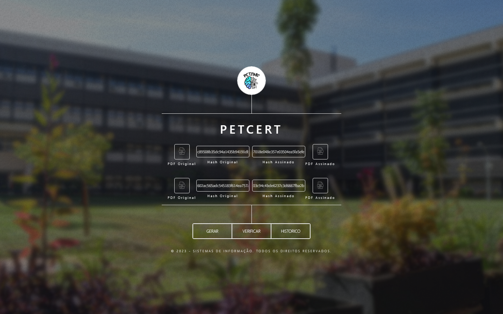
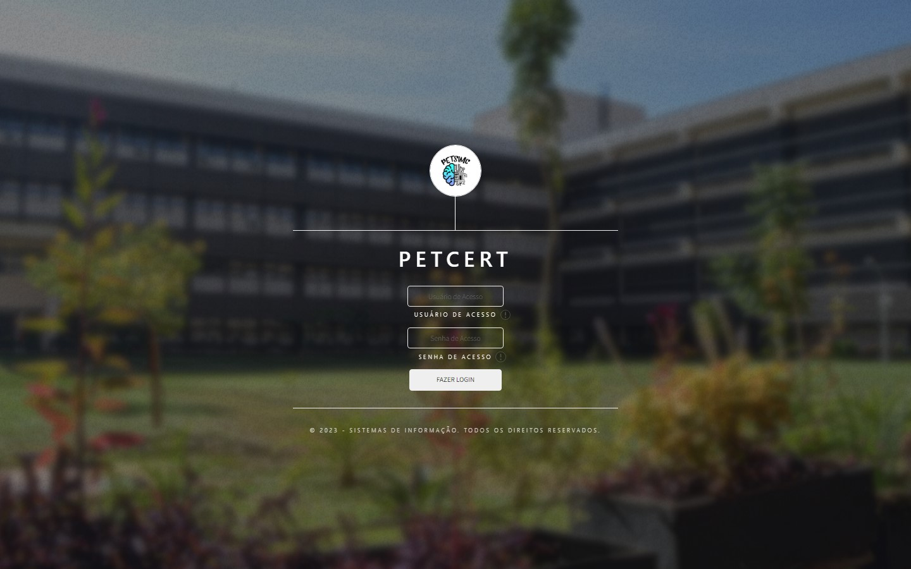

# PET-Cert Front-End

PET-Cert Front-End is a web-app created to create, verify and show history of PET-SIMC certificates.  

Uses Firestore as storage for all generated certificates.


<h1>Features:</h1>

<ul>
    <li>Create Certificates</li>
    <li>Verify Certificates</li>
    <li>Certificates History</li>
    <li>Password Lock</li>
</ul>

-----

<h3>Create Certificates</h3>
</img>

-----

<h3>Verify Certificates</h3>
</img>

-----

<h3>Certificates History</h3>
</img>

-----

<h3>Password Lock</h3>
</img>


<h1>Instructions</h1>

<ul><h3>Requirements:</h3> 
    <li>Firestore</li>
    <li>Get-Certificate API</li>
    <li>Back-End API</li>
</ul>


Create an Firebase Database app in (https://firebase.google.com/) and insert it's credentials into .env as show in .env.example.
Insert Get-Certificate API and Back-End API deploy links into .env as show in .env.example.

After setting up, you can start the project with: 

```bash
npm install
npm start
```
